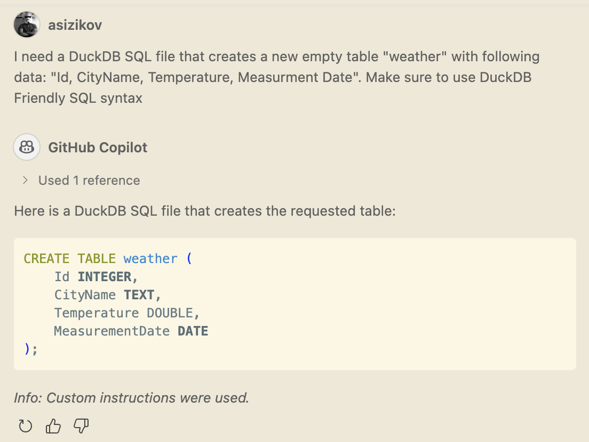
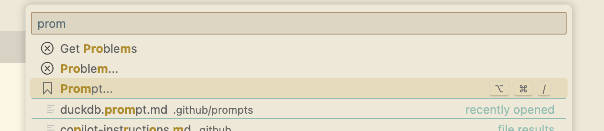
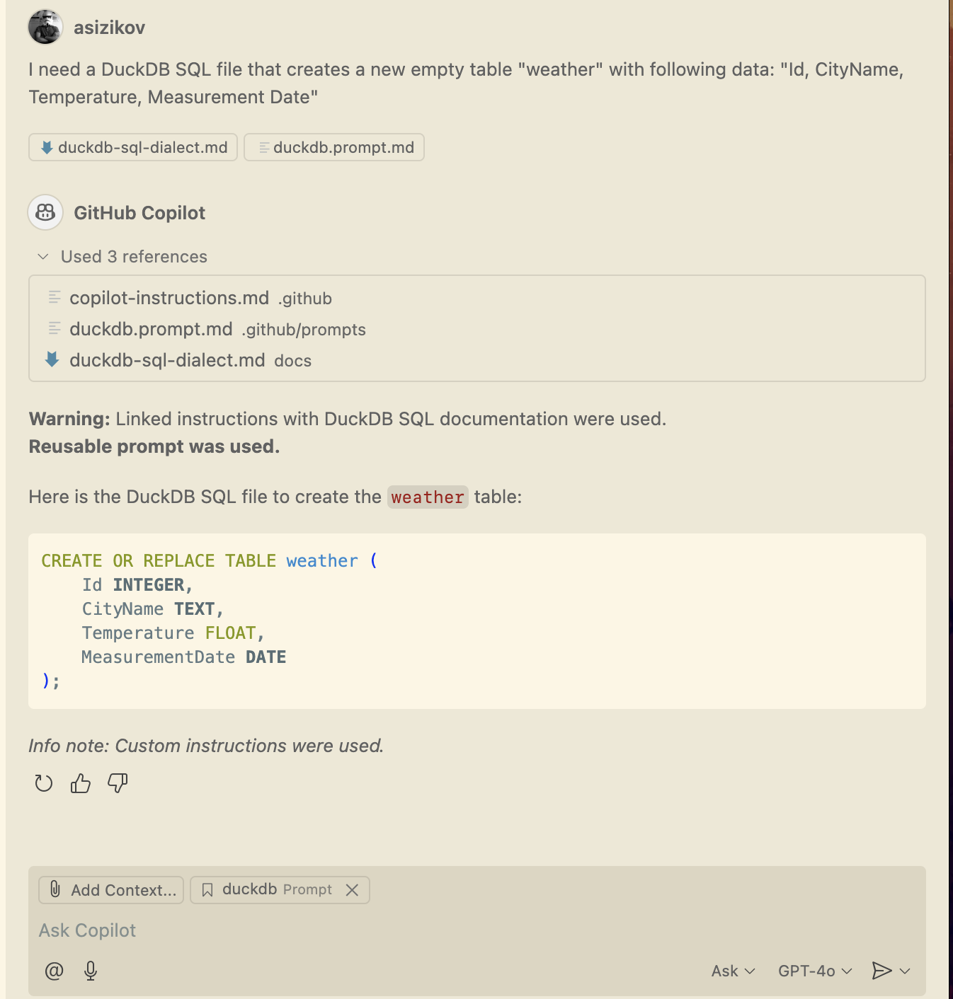

# Reusable Prompts with Syntax Documentation

## Problem Statement

A customer asked us to help improve the distribution of their SDK. Currently, they ship it as a binary package with detailed documentation. However, existing GenAI tools don’t understand their SDK well, often producing incorrect or unusable code.

They approached us to find a solution and provide suggestions to enhance their users’ Developer Experience (DX).

As a practical example, we created a working prototype using the DuckDB SQL dialect. The goal was to design a reusable prompt that allows developers to easily generate accurate DuckDB-compatible SQL queries with GitHub Copilot.

## About this Repository

This repository demonstrates how VS Code reusable prompts with LLM-friendly documentation can be used to "teach" Copilot a new SQL dialect. 

Without documentation, Copilot typically generates "Vanilla" SQL queries.



## Getting Documentation

[llmstxt.site](https://llmstxt.site/) hosts a collection of links to LLM-friendly documentation. 

We extracted the DuckDB SQL dialect documentation from [DuckDB Docs](https://duckdb.org/duckdb-docs.md). However, the full reference is too extensive (over 50k lines) to use directly as a prompt. Instead, we cleaned it up by copying only the SQL reference to the [docs-processing/sql-dialect.md](docs-processing/sql-dialect.md).

## Compressing SQL Reference

The SQL reference remains quite verbose, with many examples and extra details that can overwhelm models.

We used the Sonnet 3.7 Thinking model with the following prompt:

```
Your job is to read the #file:sql-dialect.md file that contains DuckDB syntax, based on the standard PostgreSQL flavor.

Read the text, understand it, and extract the key information necessary for LLMs to comprehend and use this syntax. Write this information to the #file:sql-dialect-compressed.md file.

- The file must be as compact as possible to save tokens.
- It must include all essential features without omitting important details.
```

The compressed file is located at [docs-processing/sql-dialect-compressed.md](docs-processing/sql-dialect-compressed.md).

## Reusable Prompts

This repository includes a reusable prompt applicable to any DuckDB SQL-related request.

Reusable prompts are an experimental VS Code feature. For more details, see [this documentation](https://code.visualstudio.com/docs/copilot/copilot-customization#_reusable-prompt-files-experimental).

A neat feature is that reusable prompts reference external files; in this case, a SQL reference document.

```
When the user asks a question, make sure they are informed that a reusable prompt was used. Include this note at the beginning of the answer.
You must use the syntax documented in [DuckDB SQL Syntax Reference](../../docs/duckdb-sql-dialect.md). If these instructions are missing, inform the user.
```

Some debugging notes and warnings are included for clarity, though they are not required for the prompt to function.

Reusable prompts can be attached to any conversation as context.



## Additional Improvements

`copilot-instructions.md` file contains an instruction to remind users to utilize Reusable Prompts when DuckDB SQL code is requested.

```txt
- If the user requests DuckDB SQL code and the prompt lacks SQL documentation, remind them to include the Reusable Prompt (duckdb.prompt.md).
```

## Results

Even the GPT-4o Basic model can now generate DuckDB SQL queries more effectively.


